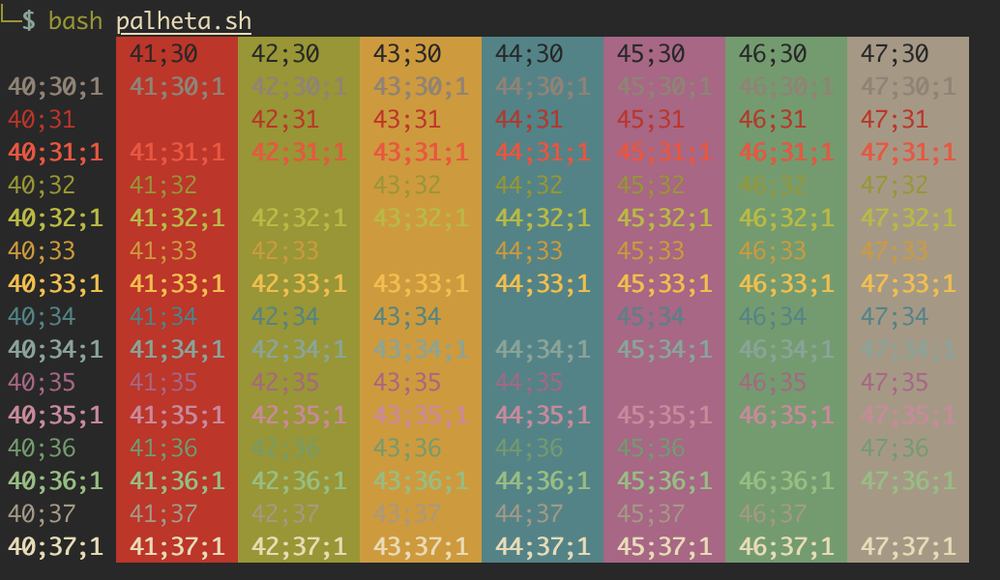

# Bash Shell Script Básico

A idéia de um shell foi concebida na época em que a interface pela qual os usuários de computadores podiam trabalhar com o computador era muito limitada. Além disso os recursos eram limitados, CPU e memória. Existia apenas um teclado, sem mouse, sem som, sem efeitos gráficos bonitos. O modo pelo qual o usuário se comunica com o computador nessa interface é escrevendo os programas que se deseja abrir (ou se quiser entender como ordens ao computador) no teclado e dando "enter". Para quem é usuário de Windows só lembrar do Dos, que nada mais é que um sistema para operar discos com uma interface limitada de um shell. Os interpretadores são vários, ksh, csh, zsh, sh e bash. Entre os diversos interpretadores existentes os usuários de Linux utilizam mais o bash. É como se os programas fossem funções e o shell fosse a interação entre os programas.

## História do Bash

O bash é uma camada que liga o usuário com o sistema operacional. Seu nome vêm de Bourne Again Shell uma intertextualização com Bourne Shell, mais conhecido com sh. O sh foi o pioneiro dos shells, a partir dele vieram os outros. O Bourne shell foi escrito por Stephen Bourne um pesquisador da AT&T Bell Labs. O bash é compatível com o sh e provê algumas funcionalidades do csh e do ksh. Ele segue o padrão IEEE Posix shell e inicialmente foi escrito para ser o shell padrão do sistema GNU. Ele tem uma portabilidade boa, existem implementações pra sistemas Windows, Mac OS X e, é claro, Linux e BSDs.

Para usuários de Windows ele pode ser usado através do projeto Cygwin. As funções são praticamente todas portadas, só tendo dependência em alguma funcionalidade do sistema Unix que o programador não pode usar(como o /proc). Com o passar do tempo o bash evoluiu junto com os sistemas abertos e hoje tem muitas mais funcionalidades e facilidades que antigamente. Saber como programar em shell ajuda também na administração do sistema. E praticamente se torna indispensável pra um bom administrador.

## Diferenças csh, ksh, dash e bash

Dentre as várias, milhares, de implementações de sistemas Unix cada uma tem uma série de softwares padrões. Assim como os usuários de Linux gostam muito de utilizar o Bash, usuários de BSDs tem uma tendência a gostar do Csh, alguns utilizam o Ksh e existem até usuários de Linux que fervorosamente usam o Zsh. As vezes é interessante saber a sintaxe de outros interpretadores, afinal nada impede de misturar diversos interpretadores em seu script maior. As vezes também portar de um sistema pra outro exige que o programador faça essas mudanças. Cada interpretador segue uma filosofia:

O **csh** por exemplo foi escrito por Bill Joy na universidade de Berkeley e consiste num shell insipirado na linguagem C. Ele segue uma forma própria, perdendo muito a compatibilidade com o sh. A filosofia do csh é pensar da mesma forma como os desenvolvedores de ferramentas do Unix, sendo que a linguagem C é quase que irmã gêmea dos sistemas Unix. Ele utiliza algumas estruturas próprias da linguagem C que são até condenadas por muitos programadores:

O goto é uma prática que deve ser desencorajada. Com raríssimas exeções o goto não precisa ser usado. Mesmo assim ele é usado até mesmo muitas vezes no Kernel do Linux. Com goto e condicional já é possível fazer qualquer outra estrutura. A sintaxe é simples

```bash
goto rotulo
rotulo:
```

Onde "rotulo" é qualquer nome (rótulo) no seu programa.

Assim como em C utiliza-se int, void, float para incializar. Em csh é necessário incializar obrigatóriamente a variável com set (set mais o nome da variável). Entre outras coisas o csh não possui "for" e as sintaxes são diferentes. Para obter mais informações, a man page do csh oferece detalhadamente as instruções de uso.

O **Ksh** por exemplo foi escrito por David Korn na AT&T Bell Laboratories. O diferencial com relação ao csh é que ele é totalmente compatível com o sh antigo. Ele além disso possui diversas funcionalidades extras, como algumas funções do awk (e alguns utilitários comuns) são incluídas no interpretador. Segundo os desenvolvedores do Ksh isso promete, além de mais linhas de código, mais desempenho. Entre essas diferenças algumas extensões de recursos de I/O e recursos de usabilidade.

O **Zsh** foi escrito com intenção de ser um shell mais interativo. Ele possui diversas funcionalidades de auto-completar, correção automática,  sugestões de comandos errados e histórico compartilhado entre vários shells.

O **Dash** foi criado com objetivo de simplificar o interpretador e acelerar o processo de boot das ditribuições linux.

Apesar destas todas diferenças existe uma similaridade que nunca muda. Que todo comando tem uma entrada e uma saída.

## Variáveis

Variável é um espaço de memória, ao qual é atribuído um rótulo(nome) definido pelo usuário. Toda e qualquer variável pode receber um valor (número, palavra ou texto), valor este que pode ser sobreposto a qualquer momento, ou seja, um valor variável. O shell permite que sejam definidas variáveis, como nas linguagens de programação.

Exemplo de declaração de uma variável que foi atribuída uma palavra.

```bash
NOME="Douglas"
```

Exemplo de declaração de uma variável que foi atribuído um valor numérico

```bash
DIA=25
```

Como declaramos uma variável foi reservado um espaço de memória para armazenar o nome Douglas e outro espaço de memória para armazenar o número 25.

Agora para podermos listar o valor da variável podemos chamar ela com o comando echo

```bash
echo $NOME
Dougla
```

Nome que declaramos a variável como NOME porém para utilizarmos ela temos que inserir no começo do nome o carácter $ indicando que estamos chamando uma variável, então para chamarmos o número podemos fazer da seguinte forma

```bash
echo $DIA
25
```

Aqui declaramos as variáveis atribuindo um valor manualmente, porém podemos armazenar em variáveis resultado de comandos por exemplo.

Vamos inserir na variável DATA a data atual do sistema

```bash
DATA=$(date)
```

Note que para utilizarmos uma variável para receber o valor de um comando temos que colocar o comando entre $() com isso ele vai executar o comando como se fosse uma função e armazenar o resultado da função na variável.

Agora vamos ver o que temos na variável DATA

```bash
echo $DATA
Seg Dez 24 10:20:28 BRST 2012
```

## Variáveis de Ambiente

O shell possui algumas variáveis que são utilizadas para a configuração de determinados programas. O comando env fará o sistema exibir uma lista de variáveis definidas para o ambiente, semelhante à lista a seguir.

```bash
env
rvm_bin_path=/usr/local/rvm/bin
HOSTNAME=douglas.douglas.lan
GEM_HOME=/usr/local/rvm/gems/ruby-1.9.2-p320
SHELL=/bin/bash
TERM=xterm
HISTSIZE=1000
IRBRC=/usr/local/rvm/rubies/ruby-1.9.2-p320/.irbrc
QTDIR=/usr/lib64/qt-3.3
MY_RUBY_HOME=/usr/local/rvm/rubies/ruby-1.9.2-p320
QTINC=/usr/lib64/qt-3.3/include
USER=root
LS_COLORS=rs=0:di=01;34:ln=01;36:mh=00:pi=40;33:so=01;35:do=01;35:bd=40;33;01:cd=40;33;01:or=40;31;01:mi=01;05;37;41:su=37;41:sg=30;43:ca=30;41:tw=30;42:ow=34;42:st=37;44:ex=01;32:*.tar=01;31:*.tgz=01;31:*.arj=01;31:*.taz=01;31:*.lzh=01;31:*.lzma=01;31:*.tlz=01;31:*.txz=01;31:*.zip=01;31:*.z=01;31:*.Z=01;31:*.dz=01;31:*.gz=01;31:*.lz=01;31:*.xz=01;31:*.bz2=01;31:*.tbz=01;31:*.tbz2=01;31:*.bz=01;31:*.tz=01;31:*.deb=01;31:*.rpm=01;31:*.jar=01;31:*.rar=01;31:*.ace=01;31:*.zoo=01;31:*.cpio=01;31:*.7z=01;31:*.rz=01;31:*.jpg=01;35:*.jpeg=01;35:*.gif=01;35:*.bmp=01;35:*.pbm=01;35:*.pgm=01;35:*.ppm=01;35:*.tga=01;35:*.xbm=01;35:*.xpm=01;35:*.tif=01;35:*.tiff=01;35:*.png=01;35:*.svg=01;35:*.svgz=01;35:*.mng=01;35:*.pcx=01;35:*.mov=01;35:*.mpg=01;35:*.mpeg=01;35:*.m2v=01;35:*.mkv=01;35:*.ogm=01;35:*.mp4=01;35:*.m4v=01;35:*.mp4v=01;35:*.vob=01;35:*.qt=01;35:*.nuv=01;35:*.wmv=01;35:*.asf=01;35:*.rm=01;35:*.rmvb=01;35:*.flc=01;35:*.avi=01;35:*.fli=01;35:*.flv=01;35:*.gl=01;35:*.dl=01;35:*.xcf=01;35:*.xwd=01;35:*.yuv=01;35:*.cgm=01;35:*.emf=01;35:*.axv=01;35:*.anx=01;35:*.ogv=01;35:*.ogx=01;35:*.aac=01;36:*.au=01;36:*.flac=01;36:*.mid=01;36:*.midi=01;36:*.mka=01;36:*.mp3=01;36:*.mpc=01;36:*.ogg=01;36:*.ra=01;36:*.wav=01;36:*.axa=01;36:*.oga=01;36:*.spx=01;36:*.xspf=01;36:
LIBGL_DRIVERS_PATH=/usr/lib/dri:/usr/lib64/dri
__array_start=0
rvm_path=/usr/local/rvm
DATA=Seg Dez 24 10:26:22 BRST 2012
escape_flag=1
rvm_prefix=/usr/local
MAIL=/var/spool/mail/root
PATH=/usr/local/rvm/gems/ruby-1.9.2-p320/bin:/usr/local/rvm/gems/ruby-1.9.2-p320@global/bin:/usr/local/rvm/rubies/ruby-1.9.2-p320/bin:/usr/local/rvm/bin:/usr/lib64/qt-3.3/bin:/usr/local/sbin:/usr/local/bin:/sbin:/bin:/usr/sbin:/usr/bin:/root/bin
PWD=/root
EDITOR=vim
LANG=pt_BR.UTF-8
_second=1
PS1=\[\033[01;31m\][\[\033[01;36m\]\t\[\033[01;31m\]] \[\033[01;32m\]\u\[\033[01;31m\]@\[\033[01;32m\]\h \[\033[01;31m\][\[\033[01;35m\]\w\[\033[01;31m\]] \[\033[01;34m\]# \[\033[00m\]
rvm_env_string=ruby-1.9.2-p320
SSH_ASKPASS=/usr/libexec/openssh/gnome-ssh-askpass
HISTCONTROL=ignoredups
rvm_version=1.17.3 ()
SHLVL=1
HOME=/root
rvm_ruby_string=ruby-1.9.2-p320
_first=0
LOGNAME=root
QTLIB=/usr/lib64/qt-3.3/lib
CVS_RSH=ssh
GEM_PATH=/usr/local/rvm/gems/ruby-1.9.2-p320:/usr/local/rvm/gems/ruby-1.9.2-p320@global
LESSOPEN=|/usr/bin/lesspipe.sh %s
DISPLAY=:0.0
RUBY_VERSION=ruby-1.9.2-p320
G_BROKEN_FILENAMES=1
XAUTHORITY=/root/.xauthkAJmSO
_=/bin/env
```

Vamos ver o significado de algumas variáveis

| Variável |           Descrição             |
|----------|:---------------------------------|
| PATH | Utilizado para definir os diretórios de procura por programas invocados através do shell. |
| USER | Utilizado para informar o nome do usuário do shell corrente |
| LOGNAME | Utilizado para informar o nome de login do usuário corrente |
| HOME | Utilizado para informar o caminho do home do usuário corrente |
| PWD | Utilizado para informar o caminho do diretório corrente |
| LANG | Utilizado para definir o idioma preferencial |
| LC_ALL | Utilizado para definir a localidade preferencial(moeda, representação de datas, etc)|
| TMP | Utilizado para definir um diretório para arquivos temporários |
| HISTSIZE | Utilizado para definir o tamanho máximo para o arquivo $HOME/.bash_history do usuário(em kb)|
| HISTFILESIZE| Utilizado para definir o número máximo de linhas do arquivo $HOME/.bash_history do usuário |
| HISTCONTROL | Utilizado com o valor ignoredups, faz com que comandos repetidos não sejam registrados no histórico|
| INPUTRC | Utilizado para definir o arquivo de configuração do terminal (inputrc) |
| PS1 | Utilizado para definir a aparência do prompt principal do shell |
| EDITOR | Utilizado para definir o editor de texto padrão do sistema.|
| MAIL | Utilizado para definir o diretório onde ficam as mensagens de correio eletrônico recebidas. |
| SHELL | Utilizado para definir o shell a ser utilizado por padrão no sistema |
| SHLVL | Utilizado para definir o número de shell que está em execução, no momento |
| TERM | Utilizado para definir o tipo de terminal que está sendo utilizado |

## Idioma do Sistema

O idioma usado no sistema pode ser modificado facilmente através das variáveis de ambiente. Atualmente, a maioria dos programas estão sendo localizados. A localização é um recurso que especifica arquivos que contêm as mensagens de programas em outros idiomas. Pode-se usar o comando **locale** para listar as variáveis de localização do sistema e seus respectivos valores:

```bash
locale
LANG=pt_BR.UTF-8
LANGUAGE=pt_BR:pt:en
LC_CTYPE="pt_BR.UTF-8"
LC_NUMERIC="pt_BR.UTF-8"
LC_TIME="pt_BR.UTF-8"
LC_COLLATE="pt_BR.UTF-8"
LC_MONETARY="pt_BR.UTF-8"
LC_MESSAGES="pt_BR.UTF-8"
LC_PAPER="pt_BR.UTF-8"
LC_NAME="pt_BR.UTF-8"
LC_ADDRESS="pt_BR.UTF-8"
LC_TELEPHONE="pt_BR.UTF-8"
LC_MEASUREMENT="pt_BR.UTF-8"
LC_IDENTIFICATION="pt_BR.UTF-8"
LC_ALL=
```

## Variáveis do Shell

Existem variáveis pré-definidas pelo shell que podem ser bastante úteis quando se desenvolve um script. A tabela abaixo lista as principais:
| Variável |        Descrição            |
|----------|:----------------------------|
| $$ | PID do shell em execução |
| $? | Código de retorno do último comando executado (1 - para erro) |
| $! | Código de retorno do último comando executado em backgroud |
| $0 | Nome do arquivo contendo o shell script em execução |
| $1, $2, $3 ... | Cada parâmetro passado ao script na linha de comando |
| $# | Quantidade de parâmetros passados ao shell |
| $* ou $@ | Parâmetros da linha de comando, iniciando em $1 |
| "$*" | Equivalente a "$1 $2 $3 $4 ... $n" |
| "$@" | Equivalente a "$1" "$2" "$3" "$4" ... "$n"|

## Arquivo /etc/profile

Arquivo global do sistema com as configurações do ambiente shell, na maioria, definição de variáveis exportadas. Esse arquivo é válido para todos os usuários e é carregado no momento do login no sistema

```bash
cat /etc/profile
# /etc/profile: system-wide .profile file for the Bourne shell (sh(1))
# and Bourne compatible shells (bash(1), ksh(1), ash(1), ...).

if [ "`id -u`" -eq 0 ]; then
  PATH="/usr/local/sbin:/usr/local/bin:/usr/sbin:/usr/bin:/sbin:/bin"
else
  PATH="/usr/local/bin:/usr/bin:/bin:/usr/local/games:/usr/games"
fi
export PATH

if [ "$PS1" ]; then
  if [ "$BASH" ]; then
    # The file bash.bashrc already sets the default PS1.
    # PS1='\h:\w\$ '
    if [ -f /etc/bash.bashrc ]; then
      . /etc/bash.bashrc
    fi
  else
    if [ "`id -u`" -eq 0 ]; then
      PS1='# '
    else
      PS1='$ '
    fi
  fi
fi

# The default umask is now handled by pam_umask.
# See pam_umask(8) and /etc/login.defs.

if [ -d /etc/profile.d ]; then
  for i in /etc/profile.d/*.sh; do
    if [ -r $i ]; then
      . $i
    fi
  done
  unset i
fi
```

## Arquivo /etc/bash.bashrc

Arquivo global do sistema com funções e apelidos (aliases). Diferente do /etc/profile, este é carregado a cada execução do bash, que pode ser feita várias vezes dentro de um mesmo login.

```bash
cat /etc/bash.bashrc 
# System-wide .bashrc file for interactive bash(1) shells.

# To enable the settings / commands in this file for login shells as well,
# this file has to be sourced in /etc/profile.

# If not running interactively, don't do anything
[ -z "$PS1" ] && return

# check the window size after each command and, if necessary,
# update the values of LINES and COLUMNS.
shopt -s checkwinsize

# set variable identifying the chroot you work in (used in the prompt below)
if [ -z "$debian_chroot" ] && [ -r /etc/debian_chroot ]; then
    debian_chroot=$(cat /etc/debian_chroot)
fi

# set a fancy prompt (non-color, overwrite the one in /etc/profile)
PS1='${debian_chroot:+($debian_chroot)}\u@\h:\w\$ '

# Commented out, don't overwrite xterm -T "title" -n "icontitle" by default.
# If this is an xterm set the title to user@host:dir
#case "$TERM" in
#xterm*|rxvt*)
#    PROMPT_COMMAND='echo -ne "\033]0;${USER}@${HOSTNAME}: ${PWD}\007"'
#    ;;
#*)
#    ;;
#esac

# enable bash completion in interactive shells
#if [ -f /etc/bash_completion ] && ! shopt -oq posix; then
#    . /etc/bash_completion
#fi

# if the command-not-found package is installed, use it
if [ -x /usr/lib/command-not-found -o -x /usr/share/command-not-found ]; then
  function command_not_found_handle {
          # check because c-n-f could've been removed in the meantime
                if [ -x /usr/lib/command-not-found ]; then
       /usr/bin/python /usr/lib/command-not-found -- $1
                   return $?
                elif [ -x /usr/share/command-not-found ]; then
       /usr/bin/python /usr/share/command-not-found -- $1
                   return $?
    else
       return 127
    fi
  }
fi
```

## Arquivo ~/.profile

O arquivo ~/.profile ou .bash_profile é executado quando uma nova sessão do usuário é aberta. Ele é responsável pelos programas que devem ser executados na abertura da sessão, pela configuração do ambiente e pelos caminhos onde os arquivos executáveis deverão ser procurados (PATH).

```bash
cat ~/.profile 
# ~/.profile: executed by Bourne-compatible login shells.

if [ "$BASH" ]; then
  if [ -f ~/.bashrc ]; then
    . ~/.bashrc
  fi
fi

mesg n
```

## Arquivo ~/.bashrc

O arquivo ~/.bashrc é executado quando chamado pelo script ~/.bash_profile ou no momento em que o usuário abre um sub-shell. Ele pode ser editado para acrescentar definições personalizadas.

```bash
 cat ~/.bashrc
#VARIAVEIS PARA O SHELL DO ROOT
alias ls='ls --color=auto'
alias ll='ls -l'
alias l='ls -lA'
alias df='df -Th'
alias grep='grep --color'
alias egrep='egrep --color'
export EDITOR=vim
export PS1='\[\033[01;31m\][\[\033[01;37m\]\t\[\033[01;31m\]] \[\033[01;32m\]\u\[\033[01;31m\]@\[\033[01;32m\]\h \[\033[01;31m\][\[\033[01;33m\]\w\[\033[01;31m\]] \[\033[01;37m\]# \[\033[00m\]'
```

## Shell Script

Agora que já conhecemos um pouco do shell podemos começar a montar os nossos script :D

Script nada mais é que um arquivo em formato texto com uma sequencia lógica de comandos que serão interpretados pelo shell.

Scrips shell são úteis na automatização de procedimentos ou na realização de uma determinada tarefa em um sistema Linux. Muitos comandos existentes no Linux são scripts, inclusive os responsáveis pela inicialização dos serviços do sistema.

Vamos utilizar o diretório /srv para o nosso trabalho com shell script

```bash
cd /srv
```

Agora vamos criar o nosso primeiro script.

```bash
vim primeiro.sh
#!/bin/bash
echo "Você esta utilizando o usuário $(whoami) no terminal $(tty) na data de $(date)"
```

Explicando:

Na primeira linha temos o Hashbang é o nome que se dá para cerquilha exclamação (“#!”) que é um sinal que identifica o interpretador que sera utilizado neste script.

Na segunda linha temos a nossa primeira saída que é uma mensagem para o usuário e estamos utilizando alguns comandos para mostrar a mensagem para o usuário o primeiro é o whoami que determina o usuário corrente, o tty vai nos mostrar qual o terminal que estamos logados no momento e o comando date vai mostrar a data.

Agora para executar o script temos duas alternativas, podemos dar a permissão para ele e mandar executar ou chamar diretamente o interpretador shell para executar ele.

Vamos executar ele diretamente com o shell primeiro.

```bash
bash primeiro.sh 
Você esta utilizando o usuário root no terminal /dev/pts/0 na data de Seg Dez 24 11:24:27 BRST 2012
```

Note que a saída para o usuário foi mostrada com os valores obtidos pelos comandos :D

Agora vamos ver a execução dando permissão para o script

Vamos primeiro dar a permissão de execução no script

```bash
chmod +x primeiro.sh
```

Agora vamos mandar executar ele

```bash
./primeiro.sh 
Você esta utilizando o usuário root no terminal /dev/pts/0 na data de Seg Dez 24 11:25:53 BRST 2012
```

Note que tivemos uma saída parecida com a anterior mudou somente o minuto e os segundos da data :D

## Passando parâmetros ao script

Uma característica importante nos scripts é a possibilidade de passar parâmetros através da linha de comando. Esta habilidade permite que sejam passados dados, nomes de arquivos, diretórios, etc, para serem manipulados pelo programa.

Vamos utilizar o exemplo de uma pesquisa

```bash
vim pesquisa.sh
#!/bin/bash
find $1 -iname $2
```

Note que o script vai utilizar o find para efetuar a pesquisa e no find precisamos especificar aonde queremos efetuar a pesquisa e o que queremos, então o $1 vai ser trocado pelo primeiro parâmetro que vamos passar para o script e o $2 vai ser o segundo parâmetro que vamos passar para o script.

Agora vamos mandar pesquisar o arquivo resolv.conf no diretório /etc

```bash
bash pesquisa.sh /etc resolv.conf
/etc/resolv.conf
```

Agora se eu quiser procurar todos os arquivos .conf do diretório /etc no sistema eu preciso passar o $2 entre aspas da seguinte forma

```bash
bash pesquisa.sh /etc "*.conf"
```

Podemos ainda efetuar a nossa pesquisa de modo interativo, perguntando para o usuário o que ele deve informar para o script

```bash
vim pesquisaint.sh
#!/bin/bash
echo "Script para pesquisa de arquivos no sistema"
echo
echo "Escolha o diretório que deseja efetuar a pesquisar: "
read DIRETORIO
echo
echo "Escolha o arquivo de deseja pesquisar: "
read ARQUIVO
echo 
find $DIRETORIO -iname $ARQUIVO
```

Agora vamos executar o nosso script

```bash
bash pesquisaint.sh 
Script para pesquisa de arquivos no sistema

Escolha o diretório que deseja efetuar a pesquisar: 
/etc

Escolha o arquivo de deseja pesquisar: 
*.conf

/etc/nsswitch.conf
/etc/gai.conf
/etc/snmp/snmp.conf
/etc/exim4/update-exim4.conf.conf
/etc/discover-modprobe.conf
/etc/logrotate.conf
/etc/initramfs-tools/initramfs.conf
/etc/initramfs-tools/update-initramfs.conf
/etc/updatedb.conf
/etc/rsyslog.d/postfix.conf
/etc/ld.so.conf
/etc/dkms/framework.conf
/etc/host.conf
/etc/kernel-img.conf
/etc/ltrace.conf
/etc/security/limits.conf
/etc/security/access.conf
/etc/security/namespace.conf
/etc/security/group.conf
/etc/security/sepermit.conf
/etc/security/time.conf
/etc/security/pam_env.conf
/etc/ld.so.conf.d/libc.conf
/etc/ld.so.conf.d/x86_64-linux-gnu.conf
/etc/pam.conf
/etc/ca-certificates.conf
/etc/resolv.conf
/etc/rsyslog.conf
/etc/adduser.conf
/etc/apt/listchanges.conf
/etc/ldap/ldap.conf
/etc/reportbug.conf
/etc/hdparm.conf
/etc/ucf.conf
/etc/gssapi_mech.conf
/etc/sysctl.conf
/etc/dhcp/dhclient.conf
/etc/sensors3.conf
/etc/udev/links.conf
/etc/udev/udev.conf
/etc/deluser.conf
/etc/debconf.conf
/etc/insserv.conf
/etc/modprobe.d/blacklist.conf
/etc/modprobe.d/fbdev-blacklist.conf
/etc/modprobe.d/aliases.conf
/etc/libaudit.conf
/etc/mke2fs.conf
```

## Construções condicionais

Construções condicionais ou de decisão são declarações que fazem com que determinados códigos sejam executados dependendo do resultado de um teste (verdadeiro ou falso). Esse tipo de construção faz com que os scripts fiquem bem mais flexíveis, pois pode-se executar certos comandos apenas se determinada condição for satisfeita. Serão vistos adiante os componentes necessários para trabalhar com condicionais em scripts.

## Expressões

Nas construções condicionais existe a figura das expressões que serão testadas. Essas expressões podem ter naturezas diferentes. Logo, para cada tipo diferente de expressão a ser testada, existe um tipo diferente de operador a ser utilizado. Esse operadores podem ser os que seguem.

## Teste Numéricos

Os operadores para testes de expressões numéricas são:
|Expressão|   Significado    | Verdadeiro se:   |
|:--------|:-----------------|:-----------------|
| x -eq y | x equal y | x for igual a y |
| x -ne y | x not equal y | x for diferente de y  |
| x -ge y | x greater or equal y | x for maior ou igual a y |
| x -gt y | x greater than y | x for maior que y |
| x -le y | x less or equal y | x for menor ou igual a y |
| x -lt y | x less than y | x for menor que y |

## Testes com Strings

Os operadores utilizados para fazer testes com strings são:
| Expressão |     Verdadeiro se:       |
|:----------|:-------------------------|
| string | string não é nula|
| -z string | string é nula |
| -n string | string tem tamanho diferente de zero|
| string1 == string2 | string1 é igual a string2 |
| string1 != string2 | string1 é diferente da string2 |

OBS: Sempre utilize string dentro de "" da seguinte forma "string1" para evitar problemas.

## Testes com Arquivos

AS expressões que testam arquivos podem ser utilizadas para comparações e verificações entre determinados arquivos:
| Expressão |             Verdadeiro se:            |
|:----------|:--------------------------------------|
| -e arquivo | arquivo existe |
| -f arquivo | arquivo existe e é um arquivo normal |
| -r arquivo | arquivo pode ser lido |
| -w arquivo | arquivo pode ser gravado |
| -x arquivo | arquivo pode ser executado |
| -d arquivo | arquivo é um diretório |
| -b arquivo | arquivo é um dispositivo de bloco |
| -c arquivo | arquivo é um dispositivo de caractere |
| -L arquivo | arquivo é um link simbólico |
| -p arquivo | arquivo é um pipe |
| -S arquivo | arquivo é um socket |
| -s arquivo | arquivo tem tamanho > 0 (maior que zero)|
| -g arquivo | arquivo possui setgid ligado |
| -u arquivo | arquivo possui setuid libado |
| -k arquivo | arquivo possui bit stick ligado |
| arq1 -nt arq2 | arquivo1 é mais novo do que arquivo2 |
| arq1 -ot arq2 | arquivo1 é mais velho do que arquivo2|
| arq1 -ef arq2 | arquivo1 e arquivo2 possuem o mesmo número de inode. |

## Testes Booleanos

As expressões de teste suportam os operadores booleanos AND, OR e NOT:
| Expressão |   Significado  |   Descrição   |
|:----------|:---------------|:--------------|
|!expressão | Não expressão | Verdadeiro se expressão for falsa |
| [exp1] && [exp2] ou [ exp1 -a exp2 ] | expressão1 E expressão2 | Verdadeiro se as duas expressões forem verdadeiras |
| [exp1] \|\| [exp2] ou [ exp1 -o exp2 ] | expressão1 OU expressão2 | Verdadeiro se uma das expressões for verdadeiras |

## Declaração if

A declaração if executa determinadas linhas de comandos dependendo se uma expressão condicional for verdadeira ou falsa.

Vamos ver a sua sintaxe.

```bash

if [ condição1 ]; then
     comandos1;
elif [ condição2 ]; then
     comandos2;
else
     comandos3;
fi
```

No if, uma condição é testada, se ela for verdadeira os comandos1 serão executados. Se ele não for verdadeira, se a segunda for verdadeira (**elif** - se não, se), os comandos2 serão executados. E se não (**else**), sobra somente a terceira opção, neste caso, os comandos3 serão executados e a declaração será finalizada com fi.

Vamos criar um script para efetuar alguns testes

```bash
vim if.sh
#!/bin/bash
#Script para efetuar a verificação entre dois números


#Declarando as variáveis para compararmos
X=10
Y=20

#Vamos verificar se X é igual a Y
if [ $X -eq $Y ]; then
    echo "X é igual a Y"
fi

#Vamor verificar se X é diferente de Y
if [ $X -ne $Y ]; then
    echo "X é diferente de Y"
fi

#Vamos verificar se X é maior ou igual a Y
if [ $X -ge $Y ]; then
    echo "X é maior ou igual a Y"
fi

#Vamos verificar se X é maior que Y
if [ $X -gt $Y ]; then
    echo "X é maior que Y"
fi

#Vamos verificar se X é menor ou igual a Y
if [ $X -le $Y ]; then
    echo "X é menor ou igual a Y"
fi

#Vamos verificar se X é menor que Y
if [ $X -lt $Y ]; then
    echo "X é menor que Y"
fi
```

Agora vamos mandar execucar o script

```bash
bash if.sh 
X é diferente de Y
X é menor ou igual a Y
X é menor que Y
```

Note que a cada expressão que deu verdadeiro foi dado uma mensagem dizendo o que foi confirmado.

Agora vamos utilizar uma expressão para utilizar o if, elif e o else

```bash
vim if2.sh
#!/bin/bash
#Script para testar o if, elfi e o else

#Vamos declarar duas variaveis
X=10
Y=15

if [ $X -eq $Y ]; then
    echo "X é igual a Y"
elif [ $X -gt $Y ]; then
    echo "X é maior que Y"
else
    echo "X Não é igual ou maior que Y"
fi
```

Agora vamos executar o nosso script

```bash
bash if2.sh 
X Não é igual ou maior que Y
```

Aqui o valor foi passado pela primeira expressão aonde ele compara se X é igual a Y porém não é com isso ele vai para o elif que compara se X é maior que Y porém ele não é, com isso só sobra o else que vai ser executado caso nenhuma das duas alternativas anteriores desse verdadeiro que é o nosso caso com isso vai aparecer que X não é igual ou maior que Y

Agora vamos fazer um teste com uma string

```bash
vim string.sh
#!/bin/bash
#Script para verificar a diferença entre strings

#Declarando as variáveis
STRING1="Douglas"
STRING2=""
STRING3="Douglas"

#Verifica se a string não é nula
if [ "$STRING1" ]; then
   echo "A String1 com o valor $STRING1 não é nula"
fi

#Verifica se a string é nula
if [ -z "$STRING2" ]; then
   echo "A String2 com o valor $STRING2 é nula"
fi

#verifica se a string tem tamanho diferente de zero
if [ -n "$STRING3" ]; then
   echo "A String3 com o valor $STRING3 tem o valor diferente de zero"
fi

#Verifica se a string1 é igual a string3
if [ "$STRING1" == "$STRING3" ]; then
   echo "String1 com valor $STRING1 é igual String2 com o valor $STRING3"
fi

#Verifica se a string1 é diferente da string2
if [ "$STRING1" != "$STRING2" ]; then
    echo "String1 é diferente da string2 "
fi
```

Agora vamos ver a utilização do if com um exemplo um pouco mais pratico, vamos fazer a validação de um usuário e caso ele não exista no sistema vamos criar ele.

```bash
vim criausuario.sh
#!/bin/bash
#Script para a criação de usuários.

echo "Escolha o nome para o usuário a ser criado no sistema: "
read USUARIO

CHECA=$(grep -i $USUARIO /etc/passwd)

if [ -z $CHECA ]; then
    useradd -m $USUARIO
    echo "Usuário: $USUARIO criado com sucesso"
else
    echo "O usuário: $USUARIO já existe no sistema"
fi
```

Agora vamos executar o nosso script

```bash
 bash criausuario.sh 
Escolha o nome para o usuário a ser criado no sistema: 
jose
Usuário: jose criado com sucesso
```

## Test

Outra forma de construção do condicional if é utilizando o comando test ao invés de utilizar colchetes "[]". O resultado é exatamente o mesmo, é apenas uma outra forma de testar as condições.

Agora vamos ver o script de criação de usuários utilizando o test

```bash
vim criausuario2.sh
#!/bin/bash
#Script para a criação de usuários utilizando o test

echo "Escolha o nome para o usuário a ser criado no sistema: "
read USUARIO

CHECA=$(grep -i $USUARIO /etc/passwd)

if test  -z $CHECA ; then
    useradd -m $USUARIO
    echo "Usuário: $USUARIO criado com sucesso"
else
    echo "O usuário: $USUARIO já existe no sistema"
fi
```

Agora vamos executar o nosso script

```bash
bash criausuario2.sh 
Escolha o nome para o usuário a ser criado no sistema: 
maria
Usuário: maria criado com sucesso
```

## Declaração case

Outro comando de estrutura condicional muito utilizado é o case, que possui a mesma finalidade do if, porém é mais utilizado quando a quantidade de testes condicionais é muito alta.

Sintaxe do case:

```bash
case CONDICAO in 
  OPCAO) 
  comandos ;;
  OPCAO2)
  comandos ;;
esac
```

Vamos a um exemplo do uso do case para criação de diretórios

```bash
vim case.sh
#!/bin/bash
#Exemplo do uso do case

#Declarando o nosso menu de opções
echo "Escolha uma das opções: "
echo "1 - Criar um diretório"
echo "2 - Remover um diretório"
read OPCAO


#Aqui iniciamos o nosso case
case $OPCAO in
   1) echo "Qual o caminho completo do diretório que deseja criar? :"
      read DIRETORIO
      
      #Vamos validar se o diretório a ser criado já não existe no sistema
      if test ! -d $DIRETORIO ; then
      mkdir $DIRETORIO
      else 
      echo "Diretório já existe"
      exit 0
      fi
      
      #Agora vamos verificar se o diretório foi criado com sucesso caso sim mostra mensagem, caso não ele cai no else
      if test -d $DIRETORIO ; then
          echo "Diretório $DIRETORIO criado com sucesso"
      else
          echo "Não foi possível criar o diretório $DIRETORIO"
      fi
      ;;
   2) echo "Qual o caminho completo do diretório que deseja remover: :"
      read DIRETORIO;
      
      #Vamos testar se o diretório existe
      if test -d $DIRETORIO; then
      rm -r $DIRETORIO
         #Testa se o diretório foi removido com sucesso
         if test ! -d $DIRETORIO; then
            echo "Diretório foi removido com sucesso!"
         fi
      #Valida se o diretório não existe
      elif test ! -d $DIRETORIO; then
        echo "O diretório não existe!"
      else
        echo "Não foi possível remover o diretório"
      fi;;
         
   *) echo "Opção inválida" ;;
esac
```

Agora vamos executar o script e testar a primeira opção.

```bash
bash case.sh 
Escolha uma das opções: 
1 - Criar um diretório
2 - Remover um diretório
1   
Qual o caminho completo do diretório que deseja criar? :
/tmp/maria
Diretório /tmp/maria criado com sucesso
```

Agora vamos executar o script e testar a segunda opção

```bash
bash case.sh 
Escolha uma das opções: 
1 - Criar um diretório
2 - Remover um diretório
2
Qual o caminho completo do diretório que deseja remover: :
/tmp/maria
Diretório foi removido com sucesso!
```

## Declaração while

A declaração while é usada para repetir comandos até que uma dada condição seja avaliada como falsa. É usada quando não é possível prever ou calcular quantas repetições dever ser executadas.

A sintaxe dele é

```bash
while [ expressão ]; then
do
     comandos;
done
```

Vamos ver um exemplo da utilização do while

```bash
vim while.sh
#!/bin/bash
#Exemplo da utilização do while
 
NUM=0
 
while [ $NUM -ne 3 ];
do
   echo "Escolha uma das opções: "
   echo "1 - Criar usuário "
   echo "2 - Remover usuário "
   echo "3 - Sair"
   read NUM
 
   case $NUM in
   1) echo "Qual o nome do usuário a ser criado no sistema?:"
   read USUARIO
   
   #Valida se o usuário existe no sistema
   CHECA=$(grep $USUARIO /etc/passwd)

   #Se o usuário não existe no sistema vamos criar ele
   if test -z $CHECA ; then
   useradd -m $USUARIO
   
   #Checa novamente para ver se o usuário foi criado
   CHECA2=$(grep $USUARIO /etc/passwd)
       if test ! -z $CHECA2; then 
         echo "Usuário $USUARIO criado com sucesso"
         sleep 2
       fi
   else
       echo "Usuário já existe no sistema"
       sleep 2
   fi
   clear
   ;;
   2) echo "Qual o nome do usuário a ser removido do sistema?:"
   read USUARIO
 
   #Valida se o usuário existe no sistema
   CHECA=$(grep $USUARIO /etc/passwd)
 
   #Valida se o usuário não existe no sistema
   if test -z $CHECA ; then
     echo "Usuário $USUARIO não existe no sistema"
     sleep 2
   elif test ! -z $CHECA; then
      userdel -r $USUARIO
      CHECA2=$(grep $USUARIO /etc/passwd)
      if test -z $CHECA2; then
         echo "Usuário $USUARIO removido com sucesso"
         sleep 2
      fi
   fi
   clear
   ;;
   
   #Opção de saida
   3) echo "Saindo"; exit 0 ;;
   
   #Quando não for encontrada uma opção 
   *) echo "Opção não encontrada" ;;
esac
done

```

Agora vamos executar o script para testar, vamos criar o usuário jose, depois vamos remover ele e depois vamos sair.

```bash
bash while.sh 
Escolha uma das opções: 
1 - Criar usuário 
2 - Remover usuário 
3 - Sair
1
Qual o nome do usuário a ser criado no sistema?:
jose
Usuário jose criado com sucesso
Escolha uma das opções: 
1 - Criar usuário 
2 - Remover usuário 
3 - Sair
2
Qual o nome do usuário a ser removido do sistema?:
jose
Usuário jose removido com sucesso
Escolha uma das opções: 
1 - Criar usuário 
2 - Remover usuário 
3 - Sair
3
Saindo
```

## Declaração for

A declaração for é uma estrutura que faz com que um determinado pedaço do código seja repetido uma quantidade x de vezes. Ela recebe uma lista de elementos e processa um a um do primeiro até o último.

Vamos ver a sintaxe do for.

```bash
for variavel in comando;
do
    comandos;;
done
```

Agora vamos ver um exemplo da utilização do for.

```bash
vim for.sh
#!/bin/bash
#Script para mostrar a utilização do for

for end in $(cat /etc/passwd | cut -d ":" -f 1)
do
   echo "Usuário cadastrado no sistema: $end"
done
```

Neste exemplo eu estou fazendo a leitura linha a linha do arquivo /etc/passwd, e com o cut eu estou pegando somente a primeira coluna do arquivo ou seja o nome do usuário e mostrando este valor pela variável end.

Agora vamos executar o nosso script

```bash
bash for.sh 
Usuário cadastrado no sistema: root
Usuário cadastrado no sistema: daemon
Usuário cadastrado no sistema: bin
Usuário cadastrado no sistema: sys
Usuário cadastrado no sistema: sync
Usuário cadastrado no sistema: games
Usuário cadastrado no sistema: man
Usuário cadastrado no sistema: lp
Usuário cadastrado no sistema: mail
Usuário cadastrado no sistema: news
Usuário cadastrado no sistema: uucp
Usuário cadastrado no sistema: proxy
Usuário cadastrado no sistema: www-data
Usuário cadastrado no sistema: backup
Usuário cadastrado no sistema: list
Usuário cadastrado no sistema: irc
Usuário cadastrado no sistema: gnats
Usuário cadastrado no sistema: nobody
Usuário cadastrado no sistema: libuuid
Usuário cadastrado no sistema: Debian-exim
Usuário cadastrado no sistema: statd
Usuário cadastrado no sistema: sshd
Usuário cadastrado no sistema: douglas
Usuário cadastrado no sistema: postfix
```

## Comando seq

Um comando muito útil para usar junto com o for é o seq. A função do comando seq é gerar uma sequência numérica. Por exemplo, para fazer um loop com 10 passos, pode-se utilizar o exemplo abaixo.

```bash
vim seq.sh
#!/bin/bash
#Script para mostrar a utilização do seq

clear

for end in $(seq 10);
do
   echo "Contando : $end"
done
```

Agora vamos executar o nosso script para testar

```bash
bash seq.sh 

Contando : 1
Contando : 2
Contando : 3
Contando : 4
Contando : 5
Contando : 6
Contando : 7
Contando : 8
Contando : 9
Contando : 10
```

## Declaração de Funções

Uma função nada mais é que um bloco de comandos. Ela recebe um nome, e através desse nome pode ser chamada várias vezes dentro do mesmo script. As funções são muito utilizadas para centralizar trechos de código que seriam executados diversas vezes dentro do script, ou para separar um trecho complexo dentro do script. Utilizar funções deixa o código complexo muito mais organizado e fácil de dar manutenção.

Do ponto de vista do bash, uma função de shell é essencialmente um script dentro de outro script. As funções podem implementar as mesmas rotinas que os scripts, com a vantagem adicional de que as funções podem ser reutilizadas em outros scripts.

Para declarar uma função, utiliza-se a palavra chave function (não obrigatório) e o nome da função geralmente é em letras maiúsculas (não obrigatório), iniciando por (_) (não obrigatório) e segundo de "()" (obrigatório) por exemplo _FUNCAO(). As funções, assim como os scripts, usam argumentos e esses são tratados da mesma forma no código. Todo código contido em uma função aparece entre chaves.

A sintaxe básica de uma função é a seguinte:

```bash
function _FUNCAO()
{
    comandos;
}
```

Em funções é possível utilizar variáveis locais, que ficam restritas à função em que foram criadas e aos comandos por ela chamados. Declara-se uma variável do tipo local da seguinte forma:

```bash
local nome_variavel=valor
```

Agora vamos ver como criamos um script utilizando funções

```bash
vim funcao.sh
#!/bin/bash
#Script para demostrar a utilização de funções

#Declarando a função principal que é o nosso menu de opções
_Principal()
{
   echo "###################################################"
   echo "Opções:"
   echo "1 - Criar usuário no sistema"
   echo "2 - Remover usuário do sistema"
   echo "3 - Sair"
   echo "###################################################"
   echo "Escolha a opção desejada:"
   read opcao
   
   case $opcao in
       1) _CriarUsuario ;; #Chamada da função _CriarUsuario
       2) _RemoverUsuario ;; #Chamada da função _RemoverUsuario
       3) exit ;;
       *) "Opção invalida." ; echo ; _Principal ;;
   esac
}

#Agora vamos declarar a função _CriaUsuario
_CriarUsuario()
{
   #Questiona o usuário sobre o nome do usuário que ele deseja criar
   echo "Qual o nome do usuário a ser criado no sistema?:"
   read USUARIO

   #Valida se o usuário existe no sistema
   CHECA=$(grep $USUARIO /etc/passwd)
   
   #Se o usuário não existe no sistema vamos criar ele
   if test -z $CHECA ; then
   useradd -m $USUARIO

   #Checa novamente para ver se o usuário foi criado
   CHECA2=$(grep $USUARIO /etc/passwd)
       if test ! -z $CHECA2; then
         echo "Usuário $USUARIO criado com sucesso"
         sleep 2
       fi
   else
       echo "Usuário já existe no sistema"
       sleep 2
   fi
   clear
_Principal
}

_RemoverUsuario()
{
   echo "Qual o nome do usuário a ser removido do sistema?:"
   read USUARIO

   #Valida se o usuário existe no sistema
   CHECA=$(grep $USUARIO /etc/passwd)

   #Valida se o usuário não existe no sistema
   if test -z $CHECA ; then
     echo "Usuário $USUARIO não existe no sistema"
     sleep 2
   #Se o usuário existe no sistema vamos mandar remover ele
   elif test ! -z $CHECA; then
      userdel -r $USUARIO
      CHECA2=$(grep $USUARIO /etc/passwd)
      #Agora vamos testar se o usuário foi removido
      if test -z $CHECA2; then
         echo "Usuário $USUARIO removido com sucesso"
         sleep 2
      fi
   fi
   clear
_Principal
}
_Principal
```

Agora vamos testar o nosso script

```bash
bash funcao.sh 
###################################################
Opções:
1 - Criar usuário no sistema
2 - Remover usuário do sistema
3 - Sair
###################################################
Escolha a opção desejada:
1
Qual o nome do usuário a ser criado no sistema?:
moises
Usuário moises criado com sucesso
###################################################
Opções:
1 - Criar usuário no sistema
2 - Remover usuário do sistema
3 - Sair
###################################################
Escolha a opção desejada:
2
Qual o nome do usuário a ser removido do sistema?:
moises
Usuário moises removido com sucesso
###################################################
Opções:
1 - Criar usuário no sistema
2 - Remover usuário do sistema
3 - Sair
###################################################
Escolha a opção desejada:
3
```

## Expressões Aritméticas

Em scripts shell, para trabalhar com expressões aritméticas usa-se a seguinte construção:

```bash
$((expressão))
```

O shell reconhece os seguintes operadores aritméticos:

- \+ Adição
- \- Subtração
- \* Multiplicação
- / Divisão
- % Módulo
- \*\* Exponenciação

Vamos ver um script de exemplo

```bash
vim expressoes.sh
#!/bin/bash
#Script para demostrar expressões aritiméticas

NUM1=15
NUM2=30

#Vamos testar a Adição
SOMA=$((NUM1+NUM2))
echo "A soma do $NUM1 + $NUM2 é: $SOMA"

#Vamos testar a Subtração
SUBTRACAO=$((NUM2 - NUM1))
echo "A Subtração do $NUM2 - $NUM1 é: $SUBTRACAO"

#Vamos testar a multiplicação
MULTIPLICACAO=$(($NUM1 * $NUM2))
echo "A Multiplicação do $NUM1 por $NUM2 é: $MULTIPLICACAO"

#Vamos testar a divisão
DIVISAO=$(($NUM2 / $NUM1))
echo "A Divisão do $NUM2 por $NUM1 é: $DIVISAO"

#Vamos testar o módulo
MODULO=$(($NUM2 % $NUM1))
echo "O resultado do módulo $NUM2 por $NUM1 é: $MODULO"

#Vamos testar a exponenciação
EXPO=$((2**3))
echo "A exponenciação do número 2 por 3 é: $EXPO"
```

Agora vamos executar o nosso script

```bash
bash expressoes.sh
A soma do 15 + 30 é: 45
A Subtração do 30 - 15 é: 15
A Multiplicação do 15 por 30 é: 450
A Divisão do 30 por 15 é: 2
O resultado do módulo 30 por 15 é: 0
A exponenciação do número 2 por 3 é: 8
```

## Comando let

O comando let executa operações aritméticas com expressões inteiras. As expressões podem conter números, operadores e variáveis do shell (as variáveis não precisam ser precedidas pelo caractere $). Se contiverem espaços, as expressões deverão ser escritas entre aspas, conforme exemplo

```bash
vim let.sh
#!/bin/bash
#Exemplo da utilização do let
let i=1
let i=i+1
echo $i
```

Agora vamos executar o nosso script

```bash
bash let.sh 
2
```

Todas as expressões apresentadas para o $(()) expressões aritméticas valem para o let.

O let também pode ser utilizado para incrementar ou decrementar valores de variáveis numéricas conforme abaixo

```bash
vim let2.sh
#!/bin/bash
#Script para demostrar incremento de uma variável utilizando o let

A=1
while [ $A -lt 10 ]; 
do
     echo $A
     let A++;
     sleep 1;
done
```

Agora vamos testar o nosso script

```bash
bash let2.sh
1
2
3
4
5
6
7
8
9
```

## Utilizando Cores em scripts

Aqui vamos ver um script para montar uma palheta de cores que podemos utilizar em nossos scripts

```bash
vim palheta.sh
#!/bin/bash
#Mostra todas as combinações de cores do console

for letra in 0 1 2 3 4 5 6 7; do #Linhas: cores das letras
        for brilho in '' ';1'; do #liba/desliga cor brilante
                for fundo in 0 1 2 3 4 5 6 7; do #Colunas: cores do fundo
                        seq="4$fundo;3$letra" # compoe codigo de cores
                        echo -e "\033[$seq${brilho}m\c" # liga a cor
                        echo -e " $seq${brilho:-  } \c" # mostra codigo na tela
                        echo -e "\033[m\c" #deliga a cor
                done; echo
        done
done
```

Agora vamos mandar executar o nosso script abaixo é para aparecer no terminal a palheta toda colorida os números são os códigos utilizados para gerar a combinação de cores.



Como utilizar essa palheta a forma segue o padrão

```bash
vim fundopreto.sh
#!/bin/bash

echo -e "\033[40;37;1m Fundo preto com letra branca com brilho \033[m"
```

Aqui o \033 é para utilizarmos as cores o [40; estamos definindo que o fundo é preto o 37; estamos definindo que a cor é branca e 1m estamos definindo que a cor tem brilho.

Agora é só executar

```bash
bash fundopreto.sh 
 Fundo preto com letra branca com brilho 
```

Para não utilizar a cor de fundo podemos fazer da seguinte forma

```bash
vim semcordefundo.sh
#!/bin/bash
echo -e "\033[01;33;1m Sem cor de Fundo com letra amarela com brilho \033[m"
```

Aqui o \033 ativa as cores o 01 é para utilizar o fundo padrão e 33 é a cor amarela o 1m é o brilho e o \033[m é a desativação da cor.

Nós podemos utilizar variáveis para definir as cores e utilizar as variáveis da seguinte forma

```bash
vim variavelcores.sh
#!/bin/bash
AMARELO="\033[01;33;1m"
FECHA="\033[m"

#Agora vamos definir a saida
echo -e "${AMARELO} Mensagem em amarelo com brilho ${FECHA}"
```

Agora é só mandar executar o script.

```bash
bash variavelcores.sh 
 Mensagem em amarelo com brilho
```

Com isso é só definir as cores e ir utilizando elas pelo nome das variáveis

## Obtendo o ip externo

```bash
links http://meuip.net/ -dump | egrep " O Meu IP :" | cut -d ":" -f 2 | tr -d ' '
200.175.4.108
```
